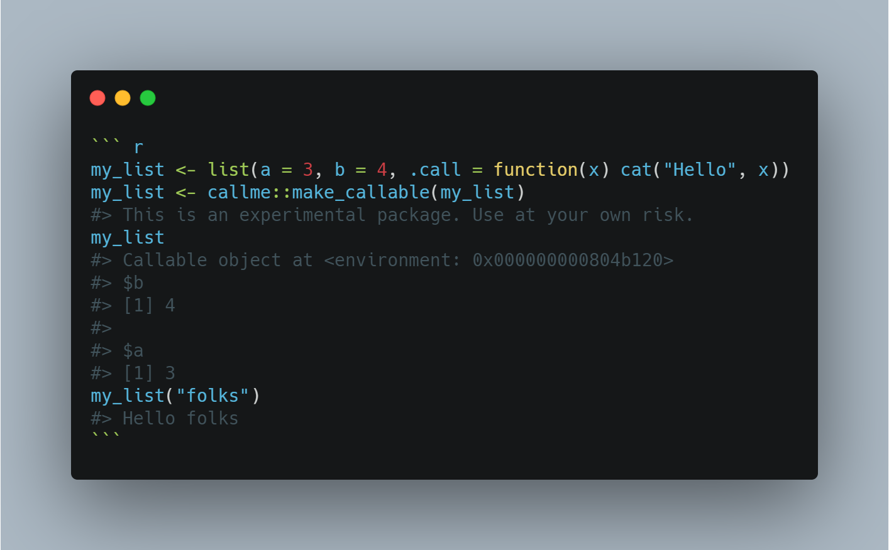

# Calling My Environment

A proof-of-concept package which converts **R** lists and environments to a (pseudo-)callable objects, just like how **Python** behaves.
It also includes a special extensions of R6 Class, which produces callable R6 generators and (optionally) callable R6 objects.

**This is an experimental package using brute-force approaches; things can change at any time. More efficient approaches are welcomed.**



## Installation

```r
# install.packages("remotes")
remotes::install_github("trinhdhk/callme", ref="main")
```

## Usage

The classic way to _callme_ is via <code>make_callable</code>.

``` r
my_list <- list(a = 3, b = 4, .call = function(x) cat("Hello", x))
my_list <- callme::make_callable(my_list)
#> This is an experimental package. Use at your own risk.
my_list
#> Callable object at <environment: 0x000000000804b120>
#> $b
#> [1] 4
#> 
#> $a
#> [1] 3
my_list("folks")
#> Hello folks
```

A prettier way to _callme_ is via <code>R6CallClass</code>.
Call target must be in the public field.

If the call target is <code>NULL</code>, only the generator shall be callable.

``` r
MyCallClass <- callme::R6CallClass(classname = "MyCallClass",
                           public = list(
                             initialize = function(){
                               cat("Hello")
                               self
                             },
                             print = function() {
                               cat("I am R6Call")
                               invisible(self)
                             },
                             .call = function(x){
                               cat("Hello", x)
                               invisible(self)
                             }
                           ), callable_object_target = ".call")
#> This is an experimental package. Use at your own risk.

mycallobj <- MyCallClass()
#> Hello
mycallobj
#> I am R6Call
mycallobj("folks")
#> Hello folks
```

## Some issues and quirky things

- Element order is reversed. :/
- **RStudio** has a function for name-indexing and auto-suggestion. The default one, however, does not work. Hence, I had to re-define it with the _exact_ same code.
- It is completely dependent on provided methods within the package. R6s seem to have no issue in compatibility, but not guaranteed for lists.

_Prost!_
